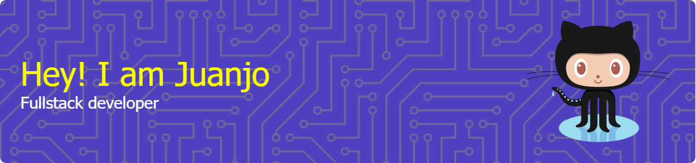

# 
## 💫 About me 
After several years working in a completely different sector, I decided to redirect my knowledge and work experience, and I immersed myself in the world of programming and computer systems.  
  

### Currently
🌳 Full-stack developer, recently graduated in Multiplatform Application Development from Universidad Europea de Madrid.

🌱 Always learning, always building 🌱

📖 I’ve got an 'Project Management Portfolio' and 'Agile and Scrum' certification

---

## 💻 My projects
### Check out my repos:

 
 A Java and JavaFX store app connected to a MySQL database, with API-based products, dynamic stock, real email confirmation, and encrypted user passwords.
 
 An Android app built with Kotlin that connects to Firebase to manage sports leagues and lets users save their favorite teams.
 
One of the evaluable exercises of the programming course made with Java and Java Swing.
 

### This is my learning path through some subjects of the Multiplatform Application Development program:
#### [Programación](https://github.com/JuanjoAJ/PROGRAMACION): This repo contains the path of the programming subject of the first year of Multiplatform Application Development in Spanish.
#### [Lenguaje de Marcas](https://github.com/JuanjoAJ/Lenguaje-de-Marcas): This repo contains the path of the markup language subject of the first year of Multiplatform Application Development in Spanish.
#### [Acceso de Datos](https://github.com/JuanjoAJ/AccesoDatos): This repo contains the path of the data access subject of the second year of Multiplatform Application Development in Spanish.
#### [PSP](https://github.com/JuanjoAJ/PSP): This repo contains the path of the programming services and processes subject of the second year of Multiplatform Application Development in Spanish.
#### [PMDM](https://github.com/JuanjoAJ/PMDM): This repo contains the path of the multimedia and mobile devices programming subject of the second year of Multiplatform Application Development in Spanish.
---
## 📊My GitHub Stats:

 
 

## 🛠️ Tech Stack:
### Languages
      
   

### Frameworks
 
 
 

### Databases

 

### VCS

---
## 🌐 Let's connect!
I am excited to connect and collaborate with you.  

Thank you for visiting my GitHub profile.   

